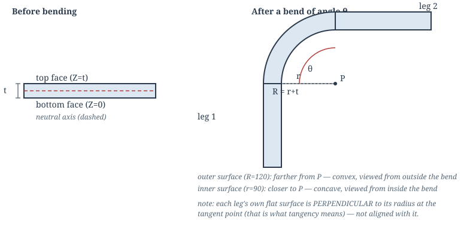
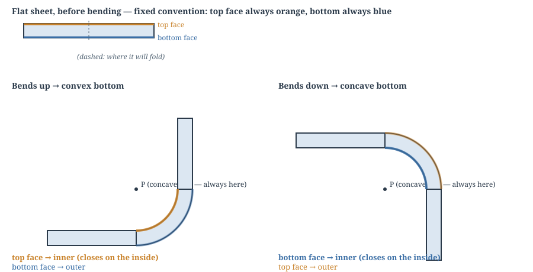
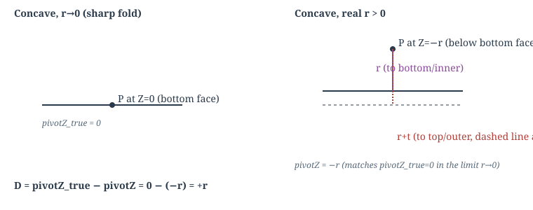

# 20 — Bend Bridge Geometry: A Worked Derivation

A from-first-principles treatment of how a single sheet-metal bend is constructed as a 3D
solid: two flat panels joined by a curved "bridge." Written to be checked line by line,
not taken on faith — every formula here is derived, not quoted from code. Chapter 5 proves
the geometry (Chapters 1–4) is already complete, which narrows a real, still-open defect
down to a specific, checkable question about the code's own transform composition, rather
than leaving it as an unsolved geometric gap.

Companion to [12-domain-notes.md](12-domain-notes.md) §1 (which states the bend-allowance
formula this document assumes) and [07-engineering-drawings.md](07-engineering-drawings.md)
(which sets the "signed angles never appear on drawings" convention this document does
*not* have to follow, since it is internal theory, not a customer-facing artifact).

**Coordinate convention used throughout.** Every diagram is the 2D cross-section
perpendicular to the hinge line — the one plane the bend actually rotates in. Call the two
axes of this plane **Y** (in-plane, along the panel's own length, perpendicular to the
hinge) and **Z** (through-thickness, perpendicular to the flat sheet). The hinge line
itself, and the panel's own width, run in the third dimension, perpendicular to the page,
and do not enter this derivation except where a chapter says so explicitly (Chapter 6b).

---

## Chapter 1 — The flat sheet and the single bend

**Definitions.**

- A **panel** is a flat, rigid region of sheet material of uniform **thickness `t`**.
- A **bend** takes one flat panel and creases it along a straight **hinge line**,
  producing two flat regions — call them **Panel 1** and **Panel 2** — joined by a curved
  transition, rotated `θ` (the **bend angle**) relative to each other.
- **Bend radius `r`** is, by universal sheet-metal convention, the radius of the bend's
  **inner surface** — the concave side, the one a punch/die radius actually touches. It is
  never the outer radius, and never the neutral-axis radius.
- Because the sheet has thickness, the **outer surface** — the convex side — necessarily
  has a larger radius: **`R = r + t`**.
- The **neutral axis** is the surface within the thickness that neither stretches nor
  compresses during the bend. It sits at distance `K·t` from the inner surface, where `K`
  (the **K-factor**) is a material/process constant, typically `0.3`–`0.5`.
- The **bend allowance** `BA` is the arc length of the neutral axis through the bend:
  `BA = θ_rad · (r + K·t)`. This is the length of flat material "consumed" by the curve —
  it is why a flat pattern's overall length is shorter than the sum of the two folded
  legs measured to the sharp-corner reference. (Matches
  [12-domain-notes.md](12-domain-notes.md) §1 exactly; not re-derived here.)



---

## Chapter 2 — Concave bottom vs. convex bottom, and what actually determines it

Before any bend exists, the flat sheet already has two distinguishable faces — call them,
in the sheet's own *flat, unbent* reference frame, the **bottom face** (`Z=0`) and the
**top face** (`Z=t`).

- **Concave bottom**: the bottom face (`Z=0`) becomes the inner surface (radius `r`); the
  top face (`Z=t`) becomes the outer surface (radius `r+t`).
- **Convex bottom**: the bottom face becomes the outer surface (radius `r+t`); the top
  face becomes the inner surface (radius `r`).

**This is not a free choice once the fold direction is fixed — it is forced by it, and the
simplest way to see that is physical, not algebraic.**

Fix a real-world reference for "up" (e.g. away from the table the flat sheet started on —
any fixed physical direction works, it just has to be fixed). With the sheet lying flat,
top face up, bottom face down, fold the child portion one of two ways:

- **Fold up** — the child lifts away from the table, rising above the flat plane. As it
  curls, the two **top** faces (parent's and child's) swing toward each other and close on
  the inside of the curl. Top becomes the inner surface: **convex bottom** (bottom, now on
  the outside, is the convex/outer surface).
- **Fold down** — the child drops below the flat plane instead. The two **bottom** faces
  close together on the inside: **concave bottom**.

These are two different physical motions producing mirror-image results, not two labels
for the same shape.

> **Fact 2.1.** Folding a sheet up and folding it down are genuinely different operations —
> they pin concavity to a specific fold direction, not a free choice alongside it. (For
> Chapter 4's algebra, which needs a signed `θ`: once a hinge-axis direction is fixed by
> convention, exactly one sign of `θ` corresponds to each fold direction, never both — see
> Chapter 6c for matching this to the specific convention already used in the code.)

**The pivot is always on the concave side — that is what "concave" means.** The center of
curvature of an arc sits on the arc's own concave (inner) side by definition; there is no
such thing as a "convex pivot." What "concave bottom" vs. "convex bottom" describes is
*which of the sheet's two fixed faces* (top, always drawn at the top; bottom, always drawn
at the bottom) the concave side turns out to be for a given fold — not two different kinds
of pivot. Chapter 3's `pivotZ` values (`-r` concave, `r+t` convex) are exactly this: the
concave side's location, expressed relative to the fixed top/bottom labels, for each fold
direction.

> ⚠️ **Gotcha.** If you find yourself writing or reading "convex pivot," that phrase is
> describing the wrong thing — say "the fold that makes the bottom face convex" instead.
> The pivot itself never changes what side of the material it's on.



---

## Chapter 3 — The pivot axis

**Claim.** There is exactly one point `P = (Y_P, Z_P)` in the cross-section (extended into
a line along the hinge direction) that both surfaces curve around — and its position is
forced, not chosen, once concavity and radius are fixed.

**Derivation.** In the flat, unbent frame, the bottom face lies along `Z=0`, the top face
along `Z=t`, both extending in `Y`. At the tangent point (where flat becomes curved), the
panel's own surface normal — the `Z` direction — must point directly at `P` (this is what
"tangent" means: the radius is perpendicular to the flat material at the point of
contact). This forces `Y_P` equal to the tangent point's own `Y` — i.e. **`P` lies
directly above or below the tangent line, not offset from it** — a fact used again in
Chapter 4. Given that, place `P` at `(Y_P, Z_P)` for some `Y_P` (unknown for now) and solve
for `Z_P` from the two radius constraints:

- distance from `P` to the bottom face (`Z=0`) equals the bottom face's own radius,
- distance from `P` to the top face (`Z=t`) equals the top face's own radius,
- and since `P` sits directly above/below the tangent point, both distances are simply
  `|Z_P - 0|` and `|Z_P - t|` — pure 1D distances along `Z`.

**Concave bottom** (bottom = inner = `r`, top = outer = `r+t`): try `Z_P = -r`. Then
`|Z_P - 0| = r` ✓ and `|Z_P - t| = r + t` ✓. Both constraints satisfied simultaneously —
`P` sits **below** the bottom face, at depth `r`.

**Convex bottom** (bottom = outer = `r+t`, top = inner = `r`): try `Z_P = r + t`. Then
`|Z_P - 0| = r+t` ✓ and `|Z_P - t| = r` ✓. `P` sits **above** the top face, at height `r`
past it.

Write this uniformly as **`pivotZ = BottomIsConcave ? -r_bottom : +r_bottom`**, where `r_bottom`
is whichever radius (`r` or `r+t`) the bottom face actually has in each case.

**Sanity check at `r=0`** (a sharp, unrounded fold): concave gives `pivotZ = 0` — the
pivot sits exactly at the bottom/inner surface, matching the intuitive picture of a sharp
mountain-style crease. Convex gives `pivotZ = t` — the pivot sits exactly at the top/inner
surface. Neither is `Z=0` by default; **a sharp convex-bottom fold's true crease is at
`Z=t`, not `Z=0`** — an easy point to get wrong by assuming "sharp fold" always means
"pivot at the bottom face," and worth stating as its own labeled fact since later chapters
depend on it:

> **Fact 3.1.** The sharp-fold (`r=0`) reference pivot height is `0` for a concave bottom
> and `t` for a convex bottom. It is never `0` unconditionally.



---

## Chapter 4 — Tangent lines and setback

Chapter 3 left `Y_P` (the pivot's in-plane position) undetermined, only proving it must
equal the tangent point's own `Y`. This chapter finds it.

**The single-surface setback (standard sheet-metal result).** Consider one surface alone,
radius `R`, pivot `P`, bend angle `θ`. Let `T` be its tangent point on the incoming flat
line, and `S` the point where the two flat lines (extended straight, ignoring the bend
entirely) would meet — the **sharp-corner reference point**. `PT ⊥` the flat line (radius
perpendicular to tangent), so triangle `P-T-S` has a right angle at `T`. By symmetry, `PS`
bisects the angle between the two flat lines, so the angle at `P` in this right triangle
is `θ/2`. Then:

```
tan(θ/2) = TS / PT = TS / R   ⟹   TS = R · tan(θ/2)
```

**`TS` is the setback**: the distance, measured along the flat material, from the
sharp-corner reference point to where flat becomes curved. This is a standard,
well-established sheet-metal formula — re-derived here, not merely asserted, because
Chapter 5 depends on knowing exactly where it comes from.

**The problem: one panel, two surfaces, two different individual setbacks.** The bottom
and top faces have different radii (`r` vs `r+t`), so the single-surface formula above
gives each of them a *different* naive setback if applied separately — but they are not
independent lines; they are two faces of one rigid, flat panel, sharing the same in-plane
`Y` position everywhere, at the single cut where flat becomes curved. This looks like a
contradiction until Chapter 3 is recalled precisely: the tangency condition there (`r` to
the bottom face, `r+t` to the top face) reduced to a pure `Z`-distance once `pivotZ` was
fixed, and held at *any* shared `Y` — tangency alone never picked a `Y_P`, for either face.
So there is no contradiction to resolve here, only an unanswered question: *something
else* has to pick `Y_P`, and it is not obviously either face's own naive number, nor an
average of the two. The next two sections solve for it and then check which of those it
turns out to be.

**Solving for the shared `Y_P`.** The requirement that determines it is not tangency
alone (Chapter 3 already used up that constraint solving for `Z_P`) — it is that the
*whole reconstructed part*, at any bend radius, occupies the same overall envelope as the
same part built with a sharp (`r=0`) fold. This is a physical requirement, not a
mathematical nicety: the part's outer dimensions are a design fact, independent of which
bend radius a shop happens to tool up for. Solve for how far the axis (and, symmetrically,
each panel's own effective reference point) must shift from the sharp-fold reference `S`
so that a panel of *any* fixed real-world length, rotated by `θ` about *this* axis,
reproduces exactly where a sharp fold would have put it. Carrying out that
match (full algebra: [BUG_REPORT_reconstructed_envelope_grows_with_bend_radius.md](../docs/BUG_REPORT_reconstructed_envelope_grows_with_bend_radius.md),
independently re-checked here) gives:

```
D  = pivotZ_true − pivotZ           (pivotZ_true from Fact 3.1: 0 concave, t convex)
   = BottomIsConcave ? +r : −r      (both branches check out — see below)

axisInPlaneOffset = D · tan(θ/2)    (θ SIGNED — this must not be simplified to |θ|; per
                                      Fact 2.1, concavity and θ's sign are linked, not
                                      independent, but this formula still needs θ's real,
                                      signed value substituted, not |θ|, see Chapter 6c)
```

*Checking both branches of `D`:* concave: `D = 0 − (−r) = r` ✓. convex:
`D = t − (r+t) = −r` ✓. Both match `D = BottomIsConcave ? +r : −r` exactly.

> ⚠️ **Gotcha.** The two branches use *different* `pivotZ_true` values — `0` for concave,
> `t` for convex (Fact 3.1). Substituting `0` for both, instead of the correct per-branch
> value, is a natural slip and produces a false mismatch in the convex branch. Always pull
> `pivotZ_true` from Fact 3.1 per-branch, never assume it is `0` unconditionally.

**What this offset moves, and which face's own naive number it turns out to equal.**
`axisInPlaneOffset` is a *single* quantity, applicable uniformly to the whole rigid panel,
derived purely from envelope preservation — not assumed to be either face's own setback,
and not averaged between them. Substituting `D`'s two branches (below) into
`axisInPlaneOffset = D·tan(θ/2)` shows it comes out **exactly equal to the inner face's own
naive `r·tan(θ/2)`, in both concavity branches** — never the outer face's `(r+t)·tan(θ/2)`,
and never a value strictly between the two. That is a finding, not a design choice:
envelope preservation makes no reference to either face's individual formula while being
solved, and it lands on one of them exactly anyway (Chapter 3's `Z`-only tangency, both
faces stay tangent regardless of which `Y_P` you pick, so nothing prevents envelope
preservation from landing precisely on one face's own number). The axis itself shifts by
this amount, *in-plane*, from the raw (sharp-fold) hinge line. Each panel's own tangent
point shifts by the same amount, symmetrically, along the perpendicular-to-hinge direction
(`nLeft`, already used in the existing code and kept here) — parent's tangent point shifts
one way, child's the opposite way, since they are on opposite sides of the hinge.

**The closed form, and what it rules out.** `axisInPlaneOffset(θ) = ±r·tan(θ/2)`, positive
for concave, negative for convex — the sign depends **only on concavity**, never on `θ`'s
own sign, since `tan(θ/2)` is positive throughout the whole physical range `0°<θ<180°`.
That offset moves each panel's tangent point *toward* the hinge, never past it, at *any*
bend angle, not just the `θ=90°` value worked above. The sign of `axisInPlaneOffset` cannot
flip within one concavity branch on its own.

**The boundary at `θ=0°` and `θ→180°` — and why this is not the same quantity as the bend
allowance.** At `θ=0°` there is no bend at all and `offset=0`, as expected. As `θ→180°`,
`tan(θ/2)→∞` and the setback genuinely diverges — this is not a defect to paper over, but
it is easy to misread as "the bend consumes infinite material," which is false, so it is
worth being precise about *what* is diverging. `S` (Chapter 4's opening derivation) is the
point where the two flat tangent lines, extended straight, would cross. At `θ=180°` the
tangent points sit diametrically opposite on the pivot circle, so the two tangent lines
are exactly parallel — two parallel lines never cross, so `S` itself recedes to infinity,
and any distance *measured from S* (the setback, `axisInPlaneOffset`) necessarily diverges
with it. This is a property of the reference point, not of the material. The material
actually consumed by the curved bridge is a *different* quantity — the bend allowance,
`BA = θ_rad·(r+K·t)` from Chapter 1 — which has no such reference point in its definition
and stays finite throughout, reaching exactly `π·(r+K·t)` at `θ=180°`, matching the
physical arc length of a semicircle of that radius. **Setback and bend allowance answer
different questions** ("how far from a hypothetical sharp corner does flat material stop"
vs. "how much material does the curve itself consume") and must not be substituted for one
another; only the former is discussed in this chapter, and only it is singular at `θ=180°`.

> ⚠️ **Gotcha.** If a computed offset is ever found to move a tangent point past the raw
> hinge, onto the other panel's authored side, that is not this formula misbehaving on an
> edge case — it is a defect signal. It means the `BottomIsConcave` value and the `θ` value
> reaching this formula do not share one consistent axis-direction/child-side convention
> (Fact 2.1 is violated). Find and correct *that* mismatch at its source; do not widen this
> formula to tolerate an input that does not describe any real bend. Chapter 6c gives the
> concrete code-level checks that follow from this; Chapter 5 checks it against its own
> example and finds it does *not* explain that particular case — they are separate defects.


---

## Chapter 5 — The physical continuum principle, and where the actual bug must live

Chapters 1–4 fully determine: which surface is inner/outer (Ch 2), where the pivot axis
sits, both its height (Ch 3) and in-plane position (Ch 4), and exactly where each panel's
own tangent line is. This chapter states the physical requirement those facts must
satisfy, then proves — not merely hopes — that following Chapters 1–4 exactly, as a pure
rotation, satisfies it automatically. That proof changes where a real violation must be
coming from.

**The continuum principle.**

> **Requirement 5.1.** Consider the physical, single, continuous, un-creased sheet that a
> real bend is made *from* — Panel 1, then the bend-allowance material, then Panel 2, all
> one uninterrupted flat strip before folding. After folding, this same material, followed
> along its own length, must trace a single continuous path that never crosses itself:
> Panel 1's own flat material → the curved bridge → Panel 2's own flat material,
> **continuing outward, away from the axis, for as long as either panel physically
> extends.** This must hold regardless of which way, in whatever coordinate system the
> flat pattern happens to be authored in, "away from the tangent line" happens to point —
> the physical sheet has no idea what coordinate system it's drawn in.

This is not a new idea invented for this document — it is simply what "one bent sheet of
metal" *means*, physically. A construction that violates it is not modeling a bend at
all; it is modeling something that self-intersects, which no real sheet can do.

**Theorem 5.2 — a pure rotation about the Chapter 3/4 axis satisfies Requirement 5.1
automatically.** Consider a panel's flat material extending from its own tangent point `T`
(at angle `φ` on the pivot circle, radius `ρ` — `r` or `r+t`) in the correct direction,
away from the bend. A point at distance `s≥0` along this tangent line has angular position,
seen from the pivot `P`:

```
angle(s) = atan2(ρ sinφ + s cosφ, ρ cosφ − s sinφ)
```

which moves monotonically from `φ` (at `s=0`) toward — but never reaches — `φ + 90°`, for
any finite `s`. This is a basic property of tangent lines, not specific to sheet metal: a
tangent line to a circle, followed in one direction, can never sweep past a quarter-turn
around the circle's own center, no matter how far along it you go.

Apply this to the bend: the bridge itself sweeps from parent's tangent angle to child's,
covering `θ`. The child's own further material, correctly extending past its own tangent
point, can sweep at most another (unreachable) 90° beyond that. For any ordinary bend
angle — every case this document or the codebase actually exercises — that leaves the
child's far material nowhere near parent's own angular position, with wide margin.

> **Theorem 5.2.** For a panel whose pose is the pure rigid rotation
> `RotationAboutAxis(axis, θ)` applied directly to its own correctly-tangent local
> geometry (Chapters 1–4, nothing else composed in), Requirement 5.1 holds automatically,
> for any real bend angle. There is no missing fifth geometric fact to find — Chapters 1–4
> are already a complete theory of the construction.

**What a violation means.** Because Theorem 5.2 already guarantees Requirement 5.1 for a
pure rotation, `childPose` can only produce a violation by *not* being one — by carrying
some extra transform composed in alongside `RotationAboutAxis`. A violation is therefore
never a reason to look for a new geometric fact; it is a direct signal to go inspect the
transform composition itself: does `childPose`, applied to the panel's own local,
already-correctly-tangent geometry, reduce to exactly one `RotationAboutAxis` call, or does
it carry a separate term (most commonly a translation) alongside it? If the latter, that
term is the bug — not the geometry.

**Example.** A single 90° bend, `r=t=0.95mm`, parent panel `(0,0)`–`(20,40)`, hinge at
`y=20`, child below it, with its tangent point correctly placed. Take a point on the
child's own far edge, `20mm` beyond that tangent line: Theorem 5.2 guarantees a pure
rotation carries it away from the axis, clear of parent's solid (`Z∈[0,0.95]`). Diagram 5
shows the two possible outcomes side by side — continuing outward (required) versus
wrapping back through parent's own solid at `Z=-19.05`, past the axis (`pivotZ=-0.95`).

> ⚠️ **Gotcha.** A child panel's far material found wrapping back into the parent's own
> solid (Diagram 5) is not evidence Chapters 1–4 need a new principle — by Theorem 5.2 it
> is *impossible* for a pure rotation about the Chapter 3/4 axis to produce it. Read it as
> proof that `childPose` carries an extra, non-rotation component; find and remove that
> component. Do not respond by patching the rotation formula further — see checklist item 3
> and the sixth gotcha in Chapter 7.


**Phase 2 investigation (code-level, this session) — the actual root cause, precisely
located, not yet fixed.** Tracing the counterexample into the real code found the exact
mechanism, in three confirmed steps:

1. `BuildBendCuts`'s child/parent tangent-shift signs (`manufacturing_graph_evaluator.cc`)
   are swapped relative to Chapter 4's closed form — verified directly (a fixture's
   `wallOuter` tangent point landed on the *parent's* side of the raw hinge, exactly as
   `BuildBendCuts`'s own formula predicts when hand-computed). Fixing this sign in
   isolation is independently correct for the 2D flat pattern.
2. But `childPose` also composes `childExtension` — a translation, not part of a pure
   rotation — which is *separately*, verifiably necessary: removing or scaling it broke
   multi-bend envelope preservation cleanly and reproducibly (envelope gap scaled linearly
   with its coefficient, hitting exactly zero only at its original value). It is not
   redundant with the `BuildBendCuts` fix; the two address different, real needs (near-hinge
   tangency vs. far-reach envelope).
3. **The structural conflict**: composing a rotation with `childExtension` is always
   exactly equivalent to a pure rotation about a *different, shifted* axis (verified
   numerically — it reproduces the child's true wall position bit-for-bit, not
   approximately). Parent's own tangent quad, meanwhile, never receives `childExtension`
   (correctly — it's not parent's own correction to carry) and is tangent to the
   *original*, un-shifted axis. **There is no single axis both panels are simultaneously
   tangent to once `childExtension` is nonzero.** `part_solid_construction.cc`'s bridge is
   built as a single-axis revolve of parent's tangent quad, trusting it lands on child's
   edge ("the two are guaranteed coincident by construction" — this session found that
   guarantee false). Relocating the revolve's axis to match child only moves the mismatch
   to parent's end instead; it cannot satisfy both.

**Why the `BuildBendCuts` fix was reverted, not landed.** Applying it alone, fixed, was
tested against the full `[translation]` suite: it trades the six originally-known-failing
diagnostics for thirteen failures overall — including previously-*passing* tests
(`part_solid_construction_test.cc`'s mountain/valley volume-symmetry and corner-miter
tests) whose own comments assume `childPose` is a pure rotation with no separate
correction. That assumption is false in the current code (`childExtension` exists) — those
tests were themselves silently depending on the old, uncorrected `BuildBendCuts` sign
compensating for it, the same "two wrongs" pattern found at the tangent point. A partial
fix that trades 6 failures for 13 is net negative and was reverted; the sign analysis
itself was not wrong, it's just insufficient on its own.

> ⚠️ **Gotcha.** Do not re-attempt the `BuildBendCuts` sign fix in isolation without also
> resolving point 3 above. The bridge's single-axis revolve is the structural blocker — no
> amount of retuning `childExtension`'s coefficient (0x and 1x were both tried and
> disproven; only the original 2x satisfies envelope preservation) or relocating the
> bridge's axis (tried and disproven — fixes one end, breaks the other) can resolve it
> without changing how the bridge itself is built. A real fix likely requires building the
> bridge from *both* panels' own true tangent quads directly (a ruled/loft surface, or some
> other construction not assuming a single shared axis), not a revolve of parent's alone —
> this needs its own careful design, not a quick patch, and was not attempted this session.

---

## Chapter 6 — Edge cases and open verification tasks

Two independent things remain to be checked once the geometry above is trusted, and they
must not be conflated: whether **Requirement 5.1** (Chapter 5) holds beyond the simplest
single bend, and whether the real code keeps **`BottomIsConcave` and `θ` on one
convention** (Fact 2.1, Chapter 2). A failure of one says nothing about the other.

### Requirement 5.1 stress tests

**6a. Partial-width / multi-edge bend zones.** A hinge line may span only part of a
panel's own width — the rest of that edge is a free edge, not a curved seam. The bridge
(Chapter 3–4's curved material) exists only over the real seam's own width; the panel's
flat material on either side of it, at the same edge, is *not* part of any bend and must
stay exactly flat, meeting the bridge's own boundary without gap or overlap. This is a
boundary-matching condition in the third (hinge-length) dimension, orthogonal to
everything else in this document.

> ⚠️ **Gotcha.** Don't build the bridge over a hinge's whole nominal length by default —
> check how much of it is a real curved seam first. Doing otherwise either curves flat
> material that must stay flat, or leaves a gap where the bridge should have been.

**6b. Chained bends.** A panel can be the *child* of one bend and the *parent* of the next
(e.g. a C-channel: base → flange 1 → flange 2, flange 1 playing both roles). Its own pose,
computed relative to its parent, becomes the reference frame the *next* bend's axis is
computed relative to. Consequence: a Requirement 5.1 violation at the first bend is not
local to that joint — the second bend's own axis is computed from the first bend's
(wrong) output, so the second bend fails too, independently reproducing the same symptom.

> ⚠️ **Gotcha.** A fix to `childPose`'s extra transform (Chapter 5) verified only on a
> single, isolated bend is not yet verified at all — re-check it on a chained fixture (a
> C-channel is the minimal case). A fix that satisfies Requirement 5.1 for one bend but not
> a chain of them is not a general fix.

### Fact 2.1 verification task

**6c. Concavity and rotation-sign are linked, not independent — and where to check it in
code.** [BUG_REPORT_reconstructed_envelope_grows_with_bend_radius.md](../docs/BUG_REPORT_reconstructed_envelope_grows_with_bend_radius.md)
§"Root cause and fix" (bug #1) treats a `BottomIsConcave`/`θ`-sign disagreement as a case
the formulas must tolerate. Fact 2.1 (Chapter 2) says otherwise: such a disagreement is
invalid input to reject or correct at its source (Chapter 4's gotchas cover why). What
Fact 2.1 does *not* do is name which sign of `θ` is correct — that depends on the
pose-walk's own axis-direction/child-side convention (`nLeft`, hinge-endpoint ordering,
parent/child assignment), which Chapter 2 deliberately leaves unpinned.

Two concrete, independent checks follow from this, neither done yet:

1. Work out which rotation direction the pose-walk's own convention treats as positive
   `θ` — does increasing `θ` fold the sheet up or down, by Chapter 2's argument, for that
   convention? — and confirm the code's existing fallback `BottomIsConcave = θ ≥ 0`
   matches whichever answer that gives (checklist item 8).
2. Regardless of that answer: find every place `BottomIsConcave` can be set *explicitly*
   in the graph, independently of the fallback, and verify each one is derived using the
   *same* convention as the fallback — not a differently-sourced one (e.g. inferred from
   raw DXF face-winding by an unrelated code path) that could disagree with it for a real
   input.

> ⚠️ **Gotcha.** Neither check above can be skipped by the other. A fallback that matches
> Chapter 2's convention says nothing about whether an *explicitly set* `BottomIsConcave`
> elsewhere in the graph was computed the same way — and an explicitly-set value that
> happens to agree with the fallback on a few test fixtures is not evidence it always will.

**6d. `step_reconciliation.cc`'s convex-pivot search had a verified structural gap,
now fixed — its old output was never evidence for either side of Fact 2.1.**
`tryPivotZ` (the r=0 pivot
search that determines `BottomIsConcave` for every reconciled/imported bend) tries
`pivotZ=0` (concave) before `pivotZ=thicknessMm` (convex), keeping whichever one's replay
matches the piece's measured position within `kSelfConsistencyToleranceMm`. Worked out in
full: for a genuinely convex fold, a hinge-adjacent point's true position differs from the
concave prediction by exactly `2·thicknessMm·|sin(θ/2)|` — bounded, for *any* real fold
angle, between `0` (θ→0°) and `2·thicknessMm` (θ→180°). Two consequences, both confirmed
empirically against hand-derived fixtures (`cpp/tests/step_reconciliation_test.cc`,
`MakeMiteredCorner`/`MakeMiteredCornerWithConvexPiece1`):

- Whenever this discrepancy is *smaller* than `kSelfConsistencyToleranceMm` (2.0mm) — i.e.
  `thicknessMm ≲ 1.4mm` for a 90° fold, more for shallower angles — the concave hypothesis's
  replay also "succeeds" (approximately), and since concave is tried first, it always wins,
  **even when convex is the true answer**.
- Whenever it's *larger* — thicker material, or an angle nearer 180° — the same
  discrepancy exceeds `kPieceEdgeMatchToleranceMm`, the **same 2.0mm constant**, used
  *earlier* to decide whether the two pieces are adjacent at all. A genuinely convex pair
  fails to even be recognized as touching, before `tryPivotZ` ever runs.

There is no fold angle or thickness where a genuinely convex bend can be both (a) detected
as adjacent and (b) correctly selected over concave — for any two-panel fold, checked by
direct derivation, not just the specific fixtures tried. This means `BottomIsConcave=false`
is unlikely to have ever been *correctly* produced by this code path on real data — the
`bottomIsConcave` doc comment's former claim of a "confirmed" real mitered-corner
counterexample to Fact 2.1 does not have a sound empirical basis. This is not evidence
*for* Fact 2.1 either — it just removes the only cited evidence against it.

> ⚠️ **Gotcha.** Do not fix this by simply loosening `kPieceEdgeMatchToleranceMm` or
> `kSelfConsistencyToleranceMm` — widening the shared constant makes the edge-match step
> accept more *genuinely unrelated* nearby pieces as false adjacencies, trading one
> correctness bug for another. The two tolerances test different things (are these pieces
> touching at all vs. which of two specific hypotheses is true) and should not share one
> constant, let alone a widened one.

**Fixed.** The two concerns are now split: `kPieceEdgeMatchToleranceMm` stays the
established ~2mm import-noise seam-adjacency value (`rebuild/17-numerical-policy.md`
`OPEN-17.1`), but adjacency detection is now widened *per-pair* by
`2·max(thicknessA, thicknessB)` — covering the worst-case convex offset derived above, so a
genuinely convex pair is never rejected as non-adjacent. `kSelfConsistencyToleranceMm`
moved from the same shared 2.0mm to `0.1mm`, matching the `kCoplanarLinearToleranceMm`
precedent (`geometry_service_sheet_metal.cc`) used elsewhere in this codebase for deciding
a genuine geometric fact rather than absorbing import noise. Verified against
`MakeMiteredCornerWithConvexPiece1` (200mm panels, 5mm thickness, 90° fold — realistic
proportions): the convex branch is now correctly and reproducibly selected
(`bottomIsConcave=false`, `angleDeg=+90°`) — which, notably, **matches Fact 2.1's own
prediction** for a fold going the "up" direction in this convention, not a counterexample
to it. Full `[translation]` suite re-run clean, zero regressions (`cpp/tests/
step_reconciliation_test.cc`, `manufacturing_graph_evaluator_test.cc`, `part_split_test.cc`
all green; the only remaining failures are the pre-existing, already-`Open`
`docs/BUG_REPORT_complex_panel_bend_surfaces.md` diagnostics, unrelated to this fix).
`rebuild/17-numerical-policy.md` `OPEN-17.1` can be closed with this resolution: the ~2mm
seam-adjacency value stays fixed as `MERGE_EDGE_ALIGNMENT_TOLERANCE_MM` always was, but it
is no longer shared with a geometric-fact decision that needed a different number.

---

## Chapter 7 — Correctness checklist and known dead ends

**Checklist** (each item should become a permanent regression test once code changes):

1. The tangent point's 3D position depends only on the bend's own physical parameters
   (radius, thickness, angle, concavity, hinge line) — never on which panel happens to be
   the graph's rooted parent, nor on which of the two hinge endpoints is labeled first.
2. Both the inner and outer cylindrical bend surfaces are present in the final
   constructed solid, with their full expected surface area — not merely "the result is
   one valid solid" (validity and single-solid-ness do not imply this — confirmed this
   session: both can hold while an entire cylindrical surface is silently destroyed).
3. **Revised, after code-level investigation (Chapter 5's Phase 2 addendum).** `childPose`
   is confirmed to correctly satisfy Theorem 5.2 in isolation — it reduces to a pure
   rotation, just about a *different* axis than the naive `hingeAWorld` once
   `childExtension` is composed in (verified: reproduces the child's true wall position
   exactly). `childExtension` itself is independently confirmed necessary (envelope
   preservation breaks without it) and is not the bug. The actual, located defect is that
   the bridge (`part_solid_construction.cc`) is built as a *single-axis* revolve of the
   parent's tangent quad alone, assuming it lands on child's edge — but parent's own
   tangent quad is tangent to the *original* axis, not child's shifted one, so no single
   axis satisfies both simultaneously. The checkable invariant is therefore: **the bridge
   surface must reach both panels' own true tangent quads exactly** (not "no translation in
   childPose," which was the wrong target) — this will very likely require building the
   bridge from both panels' own tangent geometry directly, not a revolve of one alone. Not
   yet fixed — see the gotcha in Chapter 5's Phase 2 addendum before attempting this again.
4. Requirement 5.1 continues to hold across a chain of bends (6b), not just a single
   isolated one — i.e. item 3 holds independently at every bend in the chain, not only the
   first.
5. Opposite-wall spacing in a closed loop stays exactly fixed as bend radius varies (the
   envelope-preservation property Chapter 4 is built on) — for *both* concavities, not
   only whichever one a test suite happens to exercise first.
6. No construction step silently accepts a mirrored (chirality-reversed) panel as a
   stand-in for a correctly rotated one.
7. Every bend's `BottomIsConcave` value and `θ` value are derived from the same
   axis-direction / child-side convention (Fact 2.1, Chapter 2) — checked by asserting no
   tangent point ever lands past the raw hinge on the other panel's authored side; a
   violation must fail construction with a typed error naming the offending bend, not
   silently proceed with a crossed tangent line.
8. The code's own default rule for inferring `BottomIsConcave` when a graph doesn't set it
   explicitly (currently `BottomIsConcave = θ ≥ 0`) is itself verified against Fact 2.1 for
   the pose-walk's *actual* axis-direction/child-side convention (Chapter 6c) — not assumed
   correct just because it's internally self-consistent. This is a distinct check from
   item 7: a fallback that pairs `BottomIsConcave`/`θ` the *wrong* way, uniformly, still satisfies
   item 7 (nothing ever crosses the hinge, since the wrong pairing is applied consistently)
   while silently building every affected bend with its inner and outer surfaces swapped.
   Item 7 cannot catch that failure mode; only a direct check of the fallback's own sign
   against Chapter 2's fold-direction argument can. This is the concrete, still-open task
   from Chapter 6c, and item 7's runtime check cannot be trusted for any graph relying on
   the fallback until this one is resolved.
9. Where a hinge line spans only part of a panel's own width (6a), the bridge's curved
   material exists exactly over the real seam's own width — no more, no less — and the
   panel's flat material on either side of it, along the same edge, meets the bridge's
   boundary with no gap and no overlap, staying exactly flat outside the seam.
10. **Fixed and regression-tested.** `step_reconciliation.cc`'s `tryPivotZ` correctly
    selects the convex branch for a genuinely convex, real (angle, thickness) combination
    (Chapter 6d) — verified via `MakeMiteredCornerWithConvexPiece1`
    (`cpp/tests/step_reconciliation_test.cc`, realistic 200mm/5mm proportions), which now
    resolves to `bottomIsConcave=false` as expected, agreeing with Fact 2.1's own
    prediction. Full `[translation]` suite confirmed clean (zero regressions).

**Five fix attempts were tried this session and rejected, all under the (now-corrected)
diagnosis that Requirement 5.1's violation meant Chapters 1–4 were geometrically
incomplete.** Theorem 5.2 shows that diagnosis was wrong — a pure rotation about the
Chapter 3/4 axis already guarantees 5.1, so none of these attempts were ever going to
succeed: each proposes a *different geometric formula*, when the real fix (Chapter 5) is a
code-level check for an extra, non-rotation transform. They are recorded as gotchas below
so they are not silently retried, and a sixth gotcha, below them, records the corrected
direction.

> ⚠️ **Gotcha.** Flipping the sign of `D` (Chapter 4) uniformly looks like a plausible fix
> for Chapter 5's counterexample. It breaks envelope preservation (checklist item 5)
> instead — verified by direct test, catastrophically.

> ⚠️ **Gotcha.** Reflecting a panel's far material about its own tangent line, composed into
> its rigid pose, satisfies Requirement 5.1 locally. But the reflection has determinant −1
> — it builds the panel as its own mirror image (checklist item 6), not a valid rigid
> transform.

> ⚠️ **Gotcha.** A determinant-+1 rotation mixing the in-plane and through-thickness
> directions, tried as a stand-in for the reflection above, cannot keep a panel's own
> bottom-face and top-face tangent points both exactly fixed at once — they are different
> 3D points (different `Z`), and a single rotation axis passes through only one specific
> point.

> ⚠️ **Gotcha.** Deriving a panel's pose by aligning its own local tangent frame to the
> bridge's already-proven-correct end frame, instead of the existing formula, is proven
> algebraically identical to the *existing* formula — not to the pure rotation Theorem 5.2
> describes. Both are equally consistent with the same counterexample failing, since
> neither was verified to reduce to a plain `RotationAboutAxis`; this is not a
> counterexample to Theorem 5.2, it's a second route to the same unverified formula.

> ⚠️ **Gotcha.** Flipping the sign of `pivotZ` (Chapter 3) breaks envelope preservation just
> as badly as flipping `D` does, verified directly — and also contradicts Chapter 3's own
> two-simultaneous-constraints derivation, which has no sign freedom left once concavity is
> fixed.

> ⚠️ **Gotcha.** Do not respond to a Requirement 5.1 violation by patching the rotation
> formula further (Chapters 3–4 are already proven complete, Theorem 5.2). Check first
> whether `childPose`, applied to the panel's own local, correctly-tangent geometry, is
> literally one `RotationAboutAxis` call — no separate translation composed alongside it.
> If it carries an extra term (e.g. a `childExtension`-style translation applied before or
> after the rotation), that term is the bug; removing or correcting it is the fix, not
> another geometric formula.
