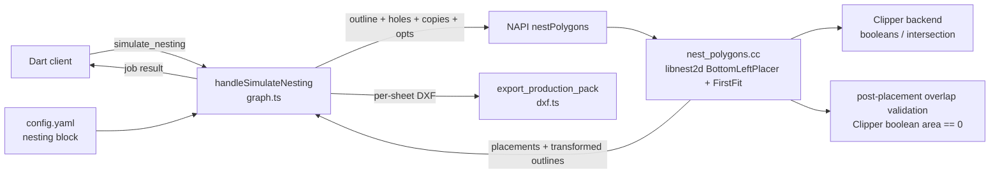

# 21 — Irregular-shape nesting via libnest2d

**Status:** Implemented (Phases 0–5, 7 done; Phase 6 UI pending). Decisions
recorded 2026-09-15; solver approach revised 2026-09-16 (see §1 deviation
note).

**Scope:** v2 only. Replaces the pure-TypeScript Shelf-Next-Fit rectangle packer
(`ts/src/v2/tools/graph.ts` → `handleSimulateNesting`) with an irregular-shape
nesting engine in C++ built on libnest2d. v1's `nestShells` / `nesting.hpp`
rectangle packer is untouched and heads for decommission with the rest of v1.

---

## 1. Locked decisions

| ID | Decision |
|---|---|
| D1 | **Geometry solution:** ~~port `tools/nfp_svgnest_glue.hpp` (SVGNest NFP, concave-capable) to the current `<libnest2d/backends/clipper/geometries.hpp>` header path. Fallback if it underperforms: vendor `libnfporb` (orbiting NFP).~~ **REVISED 2026-09-16:** both NFP paths failed against modern Boost (SVGNest glue fails to close its trace for some rotation pairs; libnfporb breaks on Boost.QVM `LongDouble` translators and returned garbage under Boost 1.91). Shipped solver is **`BottomLeftPlacer`** — a gravity-descent placer that uses the Clipper backend's own boolean intersection tests and needs no no-fit-polygon. See §4.5. |
| D2 | **Placement geometry is nesting-only.** The `simulate_nesting` result carries each placement's transformed `outline` + `holes` in the sheet frame. These are **never** written back into the part's own DFM resources (`graph://part/{id}/flat-pattern`, `boundary`, `mesh`, `findings`). Those keep emitting the part's single, original, unplaced flat pattern. |
| D3 | **Oversize part = hard fail.** A part whose outline cannot fit on one sheet fails the job with typed `NEST_PART_EXCEEDS_SHEET` (listing `part_id` + dimensions). No silent clamping — the current SNFD's `std::min(p.w, sheetW)` clamp is removed. |
| D4 | **v2-only scope.** v1 `nestShells` / `nesting.hpp` untouched. |

Quantity decisions (2026-09-15):

| ID | Decision |
|---|---|
| Q1 | **Scalar `copies` first** — applied to all parts. Per-part `quantities` map is a deferred nice-to-have, not in the initial implementation. |
| Q2 | **Fill mode is the primary behaviour** — instead of only placing one copy of each part, the tool supports filling **the one given sheet** with as many copies as fit (not unbounded sheet growth). |

---

## 2. Current state (as of 2026-09-15)

- v2 `simulate_nesting` (`ts/src/v2/tools/graph.ts`, ~1293–1397) computes each
  part's **bounding box** and runs Shelf-Next-Fit **in TypeScript**. This
  violates constitution v2.0.0 principle IV ("no geometric computation in
  TypeScript") and cannot nest irregular shapes.
- `ts/src/v2/jobs/queue.ts` `NestingResult` placement is
  `{partId, sheetIndex, x, y, rotationDeg}` — no polygon, no copy identity.
- `ts/src/v2/tools/graph.ts` `handleExportProductionPack` is a stub that throws.
- `ts/src/v2/resources/dxf.ts` has single-part flat-pattern DXF primitives only
  (`buildFlatPatternDxf`), no sheet-level nesting output.
- libnest2d is **not wired** into `cpp/CMakeLists.txt` / `cpp/vcpkg.json`
  (there is a stale `FetchContent` of `tamasmeszaros/libnest2d` left in
  `cpp/build-vcpkg/_deps/` from an earlier attempt).
- The v2 server does **not load `config.yaml`** today. `ts/config/config.yaml`
  exists as a template; `docs/CONFIG.md` references a `ts/src/config/loader.ts`
  + `schema.ts` that are not present in the tree.

### Key libnest2d fact driving D1

The stock Clipper backend (`backends/clipper/geometries.hpp`) provides integer
booleans/intersection, but its built-in NFP is **convex-only**
(`nfpConvexOnly`); the non-convex `calcnfp` branch is an unimplemented
`// TODO: implement` returning empty. The concave-capable NFP implementations
ship in `tools/` (`nfp_svgnest_glue.hpp`, `libnfporb`), but their glue headers
include the obsolete path `<libnest2d/clipper_backend/clipper_backend.hpp>`,
which no longer exists. They must be ported, not included.

> **REVISED 2026-09-16:** this port was attempted and abandoned — both NFP
> implementations are incompatible with the pinned Boost 1.91. `BottomLeftPlacer`
> (no NFP) is shipped instead; see §1 D1 and §4.5.

---

## 3. Target architecture



No OCCT involvement — consistent with `16-kernel-port.md` ("`simulate_nesting`
… 2D packing over flat-pattern point arrays").

---

## 4. Cutting width — definition, process, configuration

### 4.1 Definition

**Cutting width `W_c`** is the width of material removed by the cutting process
along a single cut line (laser/plasma/waterjet **kerf**). It is *not* the same
thing as the inter-part gap or the sheet margin; it is the physical input from
which those are derived.

### 4.2 Process used to define it

1. **Source of truth — the shop's cutting tooling.** The kerf for a given
   material/thickness comes from the tool manufacturer's spec or the shop's
   own cut test. It is not computed from the part geometry and is not a
   per-part property.
2. **Tooling ceiling.** `tooling.laser.max_kerf_width_mm` (currently `0.15`)
   already records the maximum kerf the laser can produce. `W_c` defaults to
   this value.
3. **Override.** A shop may set a dedicated `nesting.cutting_width_mm`, but it
   must be `> 0` and `<= tooling.laser.max_kerf_width_mm`. Out-of-range values
   fail with typed `NEST_INVALID_CUTTING_WIDTH` (NO-FALLBACK rule — never
   silently clamped).
4. **Derived inter-part clearance.** The minimum spacing between two part
   outlines `dist` is:

   $$dist = W_c + safety\_gap\_mm$$

   `dist` is what libnest2d's `nest(...)` receives as its `dist` (minimum
   distance between items). Rationale: two adjacent part outlines must sit at
   least one kerf apart so their two cut toolpaths never merge/over-cut; at
   exactly `W_c` they can share a single cut between them without
   over-removing material. `safety_gap_mm` (default `0`) adds extra separation
   when the process needs a retained skeleton/bridge between parts.
5. **Sheet edge margin.** Parts sit at least `nesting.sheet_margin_mm` inside
   the sheet border. Implemented by shrinking the bin `Box` passed to
   libnest2d by the margin on each side — not by shrinking the parts.

### 4.3 Configuration

`config.yaml` gains a `nesting` block (template + `ts/config/config.yaml`):

```yaml
nesting:
  cutting_width_mm: 0.15        # default = tooling.laser.max_kerf_width_mm
                                # must be > 0 and <= max_kerf_width_mm
  safety_gap_mm: 0.0            # extra inter-part spacing added to cutting width
  sheet_margin_mm: 2.0          # min distance from part outline to sheet edge
  rotations_deg: [0, 90, 180, 270]
  optimizer:                    # see §4.5
    placement_accuracy: 0.65    # 0..1 — NfpPlacer search effort (floor(1000*acc) iters)
    rotation: none              # none | genetic — global pile-rotation search
    seed: 42                    # genetic only — fixed for determinism
    max_iterations: 800         # genetic only — NLopt maxeval
    relative_score_difference: 1e-6   # genetic only — NLopt ftol_rel
```

- `simulate_nesting` accepts an optional `cutting_width_mm` override for
  one-off jobs; it is validated against the same ceiling and fails with
  `NEST_INVALID_CUTTING_WIDTH` otherwise.
- `sheet_width_mm` / `sheet_height_mm` remain tool parameters (defaults
  `2440`/`1220`) because sheet selection is per-job, while `W_c`,
  `safety_gap_mm`, `sheet_margin_mm`, allowed rotations, and the
  `optimizer` block are shop policy.

### 4.4 Loader gap

The v2 server currently reads no config. Phase 3 adds a minimal v2 config
loader (`ts/src/config/loader.ts` + Zod schema, or the documented equivalent)
so the `nesting` block is actually applied at runtime. `docs/CONFIG.md` is
updated to describe the `nesting` block.

### 4.5 Algorithms & optimiser configuration

**REVISED 2026-09-16.** The NFP/SA/GA surface described below was superseded by
`BottomLeftPlacer` (see §1 D1 deviation). The algorithm surface we actually use:

| Layer | Algorithm | libnest2d wiring | Role | Deterministic |
|---|---|---|---|---|
| Placement (always on) | **Bottom-left gravity descent** | `BottomLeftPlacer` + `FirstFitSelection` | drop each item at the top-right, slide it left/down along the pile until blocked (López-Camacho et al. 2013), using Clipper booleans — no NFP | yes |
| Rotation | **0° then 90° retry** | `BLConfig::allow_rotations` | if the 0° placement fails, rotate 90° and retry | yes |
| Validation (always on) | **Post-placement overlap check** | Clipper `Area(intersection) == 0` in `nest_polygons.cc` | reject any two same-sheet placements whose **inflated** outlines overlap with positive area (touching = 0 area, legal) | yes |

- **NFP/SA/GA: not used.** libnest2d's NFP options (`NfpPlacer` via SVGNest
  glue or vendored libnfporb) are incompatible with the pinned Boost 1.91 and
  were removed. NLopt is still linked (libnest2d requires it to compile) but no
  NLopt optimizer is invoked.
- **`rotations_deg` is ignored by this placer.** `BottomLeftPlacer` exposes only
  a boolean `allow_rotations` (0° then 90°), not a rotation set. The
  `nesting.rotations_deg` config is therefore **accepted but not honoured** —
  documented limitation, tracked for a later placer swap or libnest2d patch.
- **Overlap validation is mandatory, not optional.** `BottomLeftPlacer`'s
  wall-polygon scan can miss concave-shape collisions and report a successful
  placement that overlaps the pile. `nestPolygons` re-checks every placement
  pair with a Clipper intersection-area test and fails the nest if any pair
  overlaps (NO-FALLBACK rule). Touching along an edge/point is legal (zero
  intersection area).
- **Determinism:** the descent is greedy and stateless; no randomness, no
  genetic search. Repeated runs are byte-identical.

---

## 5. Quantity & fill mode

### 5.1 Input

`simulate_nesting` gains one primary parameter:

```
copies?: number | "fill"     // default 1
```

- `copies: <n>` — place exactly `n` copies of **each** part in `part_ids`
  (spilling to extra sheets as needed; `sheets_required` reports the count).
- `copies: "fill"` — place one copy of each part, then add complete additional
  **kits** (one more copy of every part in `part_ids`, in order) until the next
  full kit no longer fits **on the one given sheet**. Fill is single-sheet:
  the loop stops when the nest would spill to a second sheet (or overlap).
  `sheets_required` is therefore `1` in fill mode. This is the "cut out
  enough to make several parts" behaviour, and it is deterministic (no
  per-part optimiser picking favourites).

Per-part `quantities: {part_id → n}` is **deferred** (documented, not built).

### 5.2 Placement identity

Each placement gains `copy_index` (0-based) so copies of the same `part_id`
are distinguishable. `part_id + copy_index` is the unique key of a placed
piece. In fill mode `copy_index` is the actual kit ordinal.

### 5.3 Utilisation

Unchanged formula, now over the true polygon areas of **all placed copies**:

$$utilisation = \frac{\sum placed\_copy\_area}{sheets\_required \times sheet\_area}$$

---

## 6. Wire contract

### 6.1 `simulate_nesting` request

```
part_ids: string[]                 # required
sheet_width_mm?: number            # default 2440
sheet_height_mm?: number           # default 1220
copies?: number | "fill"           # default 1
cutting_width_mm?: number          # optional override; validated vs ceiling
```

### 6.2 Job result (returned by `get_job`; snake_case on the wire)

```jsonc
{
  "placements": [
    {
      "part_id": "...",
      "copy_index": 0,
      "sheet_index": 0,
      "x": 123.4, "y": 56.7,
      "rotation_deg": 90,
      "outline": [ { "x": 0, "y": 0 }, ... ],      // transformed, sheet frame
      "holes":   [ [ { "x": 0, "y": 0 }, ... ] ],  // transformed, sheet frame; [] if none
      "circle_holes": [ { "cx": 0, "cy": 0, "radius_mm": 2.5 } ]  // exact circles, transformed
    }
  ],
  "utilisation_pct": 82.4,
  "sheets_required": 2
}
```

- `outline` / `holes` / `circle_holes` are pre-transformed by C++ into the
  sheet frame so the UI painter and DXF export need no geometry knowledge.
- These fields are **additive** — existing `part_id` / `sheet_index` / `x` /
  `y` / `rotation_deg` / `utilisation_pct` / `sheets_required` remain. The
  Dart client's `SimulateNestingResult.fromJson` / `NestPlacement.fromJson`
  gain the new fields; the painter draws polygons instead of bbox rectangles.
- Nesting placement geometry stays **separate from the part's DFM resources**
  (D2). `graph://part/{id}/flat-pattern` output is unchanged.

---

## 7. Implementation phases

**Phase 0 — vendor + build libnest2d (implemented, with two deviations)**
- libnest2d: `FetchContent` pinned `663daa6` (`tamasmeszaros/libnest2d`),
  sources populated but **not** `add_subdirectory()` — its CMake is broken on
  modern CMake (`find_package(Boost ... COMPONENTS headers)`) and its clipper
  backend hard-requires Boost headers. Header-only manual wiring: define
  `LIBNEST2D_GEOMETRIES_clipper` + `LIBNEST2D_OPTIMIZER_nlopt` +
  `LIBNEST2D_THREADING_std`, add `include/` to the include path.
- **Deviation — Clipper:** NOT from vcpkg (its SourceForge download stalls);
  `FetchContent` `tamasmeszaros/libpolyclipping` pinned `784ff11`, compile
  `clipper.cpp` directly into `geometry_engine`.
- NLopt: vcpkg `nlopt`, via libnest2d's `FindNLopt` → `NLopt::nlopt`.
- **Deviation — Boost:** the clipper backend unconditionally includes
  `utils/boost_alg.hpp` (Boost.Geometry), so header-only `boost-geometry` is a
  compile-time vcpkg dependency; `find_package(Boost)` → `Boost::headers`.

**Phase 1 — geometry solution (NFP port)**
- New `cpp/src/geometry/translation/nesting/nest_polygons.{hpp,cc}`.
- Port `nfp_svgnest_glue.hpp`'s `nfp::NfpImpl<ClipperLib::Polygon, NfpLevel::...>`
  specialisations to include `backends/clipper/geometries.hpp`.
- Coordinate scaling: Clipper uses `MM_IN_COORDS = 1e6`; convert mm `double` →
  `cInt` ×1e6 with int64-overflow guards on sheet area.

**Phase 2 — C++ solver + NAPI**
- `nestPolygons(parts[], sheetW, sheetH, opts)` → `{placements[], utilisationPct,
  sheetsRequired}`.
- `libnest2d::nest` with `NfpPlacer` + `FirstFitSelection`, rotations from
  config, `dist = W_c + safety_gap_mm`, sheet margin applied to the bin.
- Multi-sheet loop: fresh `Box` for the unplaced remainder until empty; read
  back `Item::binId()` / `translation()` / `rotation()`.
- Optimiser wiring per §4.5: NFP + local subplex placement always; genetic
  whole-pile rotation search only when `optimizer.rotation: genetic`.
- Determinism: fixed input order, `NfpPConfig.parallel = false`; the genetic
  path is seeded from `optimizer.seed` (GE-13 contract).
- Oversize → `NEST_PART_EXCEEDS_SHEET`; bad cutting width →
  `NEST_INVALID_CUTTING_WIDTH`.
- Register `nestPolygons` in `cpp/src/napi/translation_binding.cc`; add the
  `GeometryBinding` method + types in `ts/src/geometry/binding.ts`.

**Phase 3 — v2 TS wiring + config**
- Add the minimal config loader and the `nesting` block; update
  `docs/CONFIG.md`.
- Replace `handleSimulateNesting` body with the addon call (outline + holes +
  copies + opts); delete the TS shelf code.

**Phase 4 — wire contract**
- Extend `NestingResult` in `ts/src/v2/jobs/queue.ts` (`copy_index`, `outline`,
  `holes`); update the snake_case conversion.
- Update this doc's contract section and `15-mcp-contract.md`'s
  `simulate_nesting` row.

**Phase 5 — export**
- Implement `handleExportProductionPack`: per-sheet DXF via a new
  `buildNestedSheetDxf` in `ts/src/v2/resources/dxf.ts`, reusing the existing
  `ringToDxfLwpolyline` / `holeToDxf` primitives and labelling copies
  `<part_id>#<copy_index>`. Pure formatting — no geometric computation in TS.
- **Implemented 2026-09-16:** `format: "dxf"` (default) re-runs the
  deterministic nest (one copy per part, 2440×1220 default sheet) and returns
  `{ dxfs: string[], sheets_required: number }` — one DXF per sheet, each
  placement on its `<part_id>#<copy_index>` layer. Non-dxf formats still fail
  (drawings resource not built). The production pack is the BOM set (copies=1),
  not a fill layout.

**Phase 6 — UI (Dart client)**
- Painter draws each placement's `outline`/`holes` polygons; parse `copy_index`
  and the new fields; keep snake_case handling.

**Phase 7 — tests**
- Implement the full testing strategy in §9, in this order (TDD: write the
  C++ no-overlap oracle first, then the solver, then the bindings, then the
  TS integration tests).
- **Implemented 2026-09-16:**
  - C++ solver tests (`cpp/tests/nest_polygons_test.cc`): rectangles, concave
    L-shapes, oversize, cutting-width, `copies:n`, fill-mode determinism,
    repeat determinism — 16/16 ctest cases pass.
  - NAPI contract tests (`cpp/tests/napi_contract/napi_types_test.cc`): result
    field types, error-code string roundtrip, invalid-cutting-width and
    oversize typed-error mapping.
  - TS integration tests (`ts/tests/integration/slice_11_async_jobs.integration.test.ts`):
    snake_case wire regression, `copies:3`, fill determinism, invalid
    cutting-width → failed job with `NEST_INVALID_CUTTING_WIDTH`, dxf export
    (per-sheet DXF + `<part_id>#<copy_index>` layer), non-dxf format failure.
  - The job queue now preserves the typed error code (`toStructuredError`)
    instead of collapsing every failure to `INTERNAL_ERROR` — required for the
    §9.4 cutting-width contract.

---

## 8. File map

| File | Change |
|---|---|
| `cpp/CMakeLists.txt` | FetchContent libnest2d + libpolyclipping; manual header-only wiring; link `NLopt::nlopt` + `Boost::headers`; compile `clipper.cpp` |
| `cpp/vcpkg.json` | add `nlopt`, `boost-geometry` |
| `cpp/src/geometry/translation/nesting/nest_polygons.{hpp,cc}` | **new** solver + NFP glue |
| `cpp/src/napi/translation_binding.cc` | register `nestPolygons` |
| `ts/src/geometry/binding.ts` | `GeometryBinding.nestPolygons` + result types |
| `ts/src/config/loader.ts` (+schema) | **new** minimal v2 config loader |
| `ts/config/config.yaml` | add `nesting` block |
| `ts/src/v2/tools/graph.ts` | rewrite `handleSimulateNesting`; implement `handleExportProductionPack` |
| `ts/src/v2/jobs/queue.ts` | extend `NestingResult` |
| `ts/src/v2/resources/dxf.ts` | add `buildNestedSheetDxf` |
| `docs/CONFIG.md` | document `nesting` block |
| `rebuild/15-mcp-contract.md` | update `simulate_nesting` row |
| `rebuild/README.md` | index this doc |
| `cpp/tests/nesting_test.cc`, `ts/tests/integration/slice_11_async_jobs.integration.test.ts` | tests |

---

## 9. Testing strategy

Three layers, matching the repo's existing test infrastructure exactly. No new
runner, no new harness.

| Layer | Framework | Target | Gating / notes |
|---|---|---|---|
| C++ solver property tests | Catch2 (`geometry_tests`) | `nestPolygons` core, no NAPI | pure 2D, no STEP fixture, no OCCT |
| C++ NAPI contract tests | Catch2 (`napi_contract_tests`) | `nestPolygons` binding arg parsing + result/error shape | matches existing `NestShells` contract-test pattern |
| TS v2 integration tests | Vitest `v2` project | `simulate_nesting` → job → result → DXF export end-to-end | requires the C++ addon built; sequential single-fork |

### 9.1 The core oracle: zero pairwise overlap

Every solver test asserts the same invariant — for every pair of placements on
the same sheet, the Clipper intersection area of their transformed outlines is
**0** (touching edges allowed; positive-area overlap never). This is exact and
cheap, and it is the single property that makes irregular-shape nesting correct
vs. the current bbox packer. Utilisation assertions are always secondary to it.

### 9.2 C++ solver tests (`cpp/tests/nesting_test.cc` + new `nest_polygons_test.cc`)

All vectors are **authored point arrays**, not STEP imports — `nestPolygons`
takes outlines directly, so these are fixture-free and OCCT-free.

- **Rectangle regression** — existing GE-12/GE-13 utilisation and determinism
  expectations are kept, but each now also asserts zero pairwise overlap.
- **Irregular L/tetris shapes** — authored concave outlines: all items placed,
  zero pairwise overlap, every placement's transformed outline inside the
  sheet bounds (accounting for `sheet_margin_mm`), every rotation ∈ the allowed
  set, and reported `utilisation_pct` equals Σ(copy area) / sheet area.
- **Holes** — a part with a hole: the hole is preserved in the returned
  `holes[]`, and (with `explore_holes` off, the default) no other part is
  placed inside it — assert via point-in-hole containment.
- **Clearance** — non-touching parts are separated by at least
  `dist = cutting_width_mm + safety_gap_mm`; touching pairs have zero
  intersection area (shared-edge contact is legal).
- **Oversize → typed error** — a part whose bbox exceeds the sheet fails with
  `NEST_PART_EXCEEDS_SHEET` naming the `part_id` and its extents. No clamp.
- **Cutting-width validation** — `cutting_width_mm > tooling.laser.max_kerf_width_mm`
  → `NEST_INVALID_CUTTING_WIDTH`.
- **Fill mode** — `copies: "fill"` with one part packs a maximal count: placed
  copies are deterministic, and a helper proves one more copy cannot fit
  (remaining free space < smallest part area). With multiple parts, every kit is
  complete (equal per-part counts) and no partial kit is placed.
- **`copies: n`** — exactly `n × part_ids.size()` placements, `copy_index`
  0..n−1 per part.
- **Determinism** — 3 runs produce byte-identical placements (exact coords),
  sheet count, and utilisation; exercised for both `rotation: none` and
  `rotation: genetic` (seeded).
- **Scale / overflow guard** — a 6000×3000 sheet with many parts exercises the
  ×1e6 integer coordinate path (6000×1e6 > int32) and verifies area math does
  not overflow int64.

### 9.3 C++ NAPI contract tests (`cpp/tests/napi_contract/napi_types_test.cc`)

- Argument validation: missing/wrong-typed args → `TypeError` (same pattern as
  the existing `NestShells` binding).
- Result shape: exact camelCase field names on the binding result
  (`placements[].copy_index`, `placements[].outline[].x/.y`,
  `placements[].holes`, `utilisationPct`, `sheetsRequired`) — the snake_case
  conversion remains a TS-handler concern, as today.
- Error mapping: `NEST_PART_EXCEEDS_SHEET` and `NEST_INVALID_CUTTING_WIDTH`
  cross the boundary as typed `GeometryError` with `code`, `message`,
  `recoverable: false` (existing `TRY_GEOMETRY` pattern).

### 9.4 TS v2 integration tests (`ts/tests/integration/`)

Added under the existing `v2` Vitest project (real addon, `pool: forks`,
`singleFork: true`); new files are appended to `vitest.workspace.ts`'s v2
`include` list.

- **Wire contract (regression)** — extend the existing snake_case test:
  placements now carry `copy_index`, `outline` (`[{x,y}...]`), `holes`; and
  still no camelCase `partId`/`rotationDeg` leak.
- **Irregular outline** — `create_part` with a concave L-shape, nest two,
  assert each placement's `outline` has >4 vertices (polygon, not bbox).
- **`copies`** — `copies: 3` → 3 placements of the same `part_id` with
  `copy_index` 0..2.
- **Fill mode** — `copies: "fill"` → placements ≥ 1, all same `part_id`, and
  two consecutive runs return identical results.
- **Cutting-width override** — a valid `cutting_width_mm` succeeds; an invalid
  one fails the job with `get_job` → `status: "failed"` and
  `error.code === "NEST_INVALID_CUTTING_WIDTH"`.
- **DFM separation (D2)** — after a successful nest, read
  `graph://part/{id}/flat-pattern`: it is unchanged (original unplaced outline,
  no rotation/translation leak).
- **Export** — after a successful nest, `export_production_pack` returns a
  job whose result contains per-sheet DXF strings with `LWPOLYLINE` entities
  carrying the transformed coordinates and the `<part_id>#<copy_index>` layer.
- **Determinism** — two sequential `simulate_nesting` calls → identical result
  JSON.

### 9.5 Acceptance criteria mapping

| AC | Where proven |
|---|---|
| AC-G.4 — nesting consumes graph-derived flat patterns directly (no `unfold_ids`) | TS integration tests drive nesting from `create_part` outlines |
| MVP — >80% material utilisation on representative panels | C++ irregular-shape utilisation test |
| GE-13 determinism | C++ 3-run determinism test (both optimiser modes) + TS determinism test |
| N5 — typed errors, no silent fallback | C++ oversize + cutting-width error tests |

`rebuild/suite/` (the core correctness suite) gets **no nesting case initially**
— it is scoped to closure/mapping. AC-G is covered by the C++ + integration
layers above; a suite case can follow later if nesting wants fixture-level
regression coverage.

### 9.6 Commands & gating

```
# C++ (solver + contract)
cmake --build cpp/build --target geometry_tests napi_contract_tests
ctest --test-dir cpp/build -R nesting

# TS (v2 integration; requires the addon built)
cd ts && npx vitest run --project v2

# TS typecheck (addon-free)
cd ts && npm run typecheck
```

- C++ nesting tests are in the normal `ctest` set (`catch_discover_tests`),
  so they run on every C++ build-test gate.
- TS nesting tests ride the existing `v2` project, so they inherit the
  sequential single-fork addon constraints and the `SUITE_V2_DRIVER=1` env
  automatically.
- Vitest coverage thresholds (85/85/80/85) apply to TS: the new `graph.ts` and
  `dxf.ts` lines must be exercised by the §9.4 tests or coverage fails.

---

## 10. Risks & open items

- **R1 — SVGNest NFP quality on degenerate outlines.** SVGNest NFP can misbehave
  on near-degenerate/self-touching outlines. Mitigation: our outlines are
  already validated as simple CCW rings before nesting; if NFP still fails,
  fall back to `libnfporb` (D1 fallback).
- **R2 — determinism.** NFP + local subplex is deterministic. The optional
  genetic rotation search is off by default; when enabled it is seeded from
  `optimizer.seed` so repeated runs are identical (GE-13 contract). Note
  libnest2d ships **no simulated-annealing optimiser** — not applicable.
- **R3 — config loader absence.** v2 reads no config today; Phase 3 must
  introduce one (small, Zod-validated) rather than hardcoding `W_c`.
- **OPEN-1 — per-part `quantities` map** (deferred, see Q1). Recorded, not
  built.
- **OPEN-2 — `15-mcp-contract.md` §4.5** says geometry job results are `Ref`s;
  the live nesting result is inline JSON. This doc records the inline shape as
  authoritative for nesting; reconcile 15's wording during Phase 4.

---

## 11. Out of scope (deferred)

- Per-part `quantities` map.
- True-shape nesting in v1 (`nestShells`).
- `drawings` resource (export pack uses DXF-only output until `07-engineering-
  drawings.md` lands).
- Part-label text entities in DXF beyond `<part_id>#<copy_index>` layer naming.
